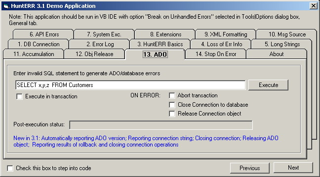



## HuntERR 3\.1 Release

### Description

URFIN JUS presents HuntERR 3.1 Release

HuntERR is powerful error handling solution for Visual Basic. Provides support for initial error processing, error logging, aborting transactions, closing connections, custom servers, reporting API errors, ADO errors, system exceptions protection, etc.

Several new features in this release: releasing objects, stopping on error in IDE, improved error report, support for logging to Oracle database, other features.

Zip includes Demo application with Source.

Full package is available at www.urfinjus.net Free.
 
### More Info
 

             |
---                |---
**Submitted On**   |2002-05-12 10:21:50
**By**             |[URFIN JUS](https://github.com/Planet-Source-Code/PSCIndex/blob/master/ByAuthor/urfin-jus.md)
**Level**          |Advanced
**User Rating**    |5.0 (40 globes from 8 users)
**Compatibility**  |VB 5\.0, VB 6\.0
**Category**       |[Debugging and Error Handling](https://github.com/Planet-Source-Code/PSCIndex/blob/master/ByCategory/debugging-and-error-handling__1-26.md)
**World**          |[Visual Basic](https://github.com/Planet-Source-Code/PSCIndex/blob/master/ByWorld/visual-basic.md)
**Archive File**   |[HuntERR\_3\_822435122002\.zip](https://github.com/Planet-Source-Code/urfin-jus-hunterr-3-1-release__1-34724/archive/master.zip)

